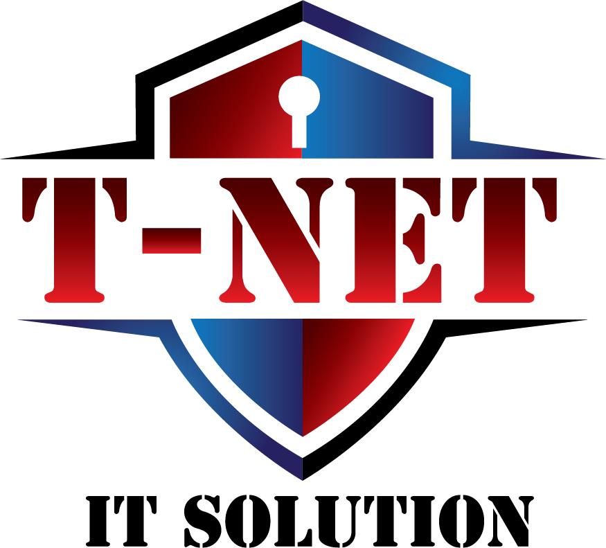

<p align="center">
  
</p>

# VulnPen

VulnPen is T-NET IT Solution's AI assistant for web application security testing. It plans and executes the OWASP WSTG v4.2 catalogue against a target, records the evidence, maps every finding to the OWASP Top 10:2025 and drafts the web application penetration testing report. A Kali attack box provides the tooling; you describe the target and it works the plan.

For authorised testing only — see [the acceptable use policy](frontend/src/app/terms/page.js) and the disclaimer at the end of this file.

## What It Does

- **Agentic execution** - the AI runs commands directly on the attack box, reads output, decides next steps, and loops. Up to 25 iterations per turn, no manual nudging required.
- **Web application security testing** - the assistant plans and works the OWASP WSTG v4.2 catalogue (97 test cases across 12 categories), records a result per test case, maps every finding to the OWASP Top 10:2025, and drafts the Web Application Penetration Testing Report.
- **Agent tools** - bash, Python scripts, tool installation, shell management, Google search, subagent spawning, Burp Suite (proxy history, Repeater, Intruder, Collaborator), browser automation, and the web application security testing tools (WSTG test plan, OWASP Top 10:2025 mapping, report generation).
- **100+ capabilities** - curated registry of security tools and Python packages across 7 categories (network, rev, pwn, crypto, forensics, stego, core). Select what you need, the agent installs the rest.
- **Burp Suite integration** - proxy history viewer, send requests to Repeater/Intruder, Collaborator for out-of-band testing. All accessible to the agent and through the UI.
- **Browser agent** - real browser automation via [Magnitude](https://github.com/magnitude-dev/magnitude). Test login flows, fill forms, interact with JavaScript-heavy apps. Optionally proxy traffic through Burp. In Docker mode, watch the browser via the built-in VNC stream; in developer mode, the browser opens on your local desktop.
- **VPN management** - upload `.ovpn`/`.conf` bundles with referenced certificates, keys, or credentials and connect/disconnect from the browser. Multiple simultaneous connections supported.
- **Subagent parallelism** - spawn background agents to run tasks concurrently (e.g. directory brute-force + subdomain enum at the same time).
- **Safety checks** - dangerous commands (recursive deletes, device writes, fork bombs) require explicit approval, even in auto-run mode.
- **Tool execution modes** - pick how the agent acts from the composer: **Auto run** (tools run automatically; destructive actions still ask), **Approve for me** (a reviewer approves boundary-crossing actions), or **Requires consent** (confirm every tool action). The choice is saved per user.
- **Composer model and reasoning pickers** - switch the orchestrator model and its reasoning effort (off / low / medium / high) inline from the chat composer, across any model registered under Settings -> Models.
- **Bring your own model** - OpenAI, Anthropic (API key or OAuth), Google, Mistral, or any OpenAI-compatible endpoint.
- **Use existing local subscriptions** - VulnPen can use an authenticated Codex CLI in Docker or host mode, and Claude Code in host/developer mode, as normal inference providers while retaining its own tool and consent loop.

## Web Application Security Testing

VulnPen's assistant is built around web application security testing. It executes the OWASP Web Security Testing Guide v4.2 methodology and reports findings against the OWASP Top 10:2025.

- **Test plans from the WSTG v4.2 catalogue** - all 97 test cases across the 12 WSTG categories (Information Gathering, Configuration and Deployment, Identity Management, Authentication, Authorization, Session Management, Input Validation, Error Handling, Cryptography, Business Logic, Client-side, API). The plan covers the full catalogue by default; restrict it to specific categories or hand-pick individual cases in the **Plan setup** dialog when the scope is narrower. Every case carries its WSTG id, section, objective, method, expected evidence, CWEs and OWASP Top 10:2025 mapping.
- **Per-case execution and tracking** - the plan is stored in the session and re-injected into the system prompt on every turn, so coverage survives context summarisation. Results are `passed`, `failed`, `blocked`, `in progress`, `skipped` or `not started`; a case that was never run is never reported as passed.
- **Findings mapped to the OWASP Top 10:2025** - precedence is an explicit classification, then the Top 10 category of the WSTG case that produced the finding, then the CWE lists OWASP publishes for each category, then a keyword classifier. Findings that cannot be placed are reported as *unmapped* instead of guessed, and the confidence and rationale are stored on the finding.
- **Draft report** - a Web Application Penetration Testing Report (document control, executive summary, scope and methodology, risk summary by severity and by Top 10 category, findings summary and detail, WSTG v4.2 coverage with untested and blocked cases, OWASP Top 10:2025 mapping, remediation roadmap, appendices) generated deterministically from the evidence the session already holds.

| Surface | What it does |
| --- | --- |
| Agent tools | `wstg_test_plan` (generate, list, get, update_case, coverage), `map_finding_owasp`, `generate_pentest_report` |
| Slash commands | `/wstg [target]` (plans the full WSTG catalogue; ask the assistant to restrict categories or add custom cases), `/map`, `/report`, plus general commands (`/summarize`, `/status`, `/clear`, `/help`, `/targets`, `/export`, `/shells`, `/reset`) |
| Session UI | **WSTG Test Plan** view: one **Plan setup** dialog (target, scope, notes and the WSTG categories to cover, with a keep/add/drop preview before saving), a progress bar with the status counts as clickable filters, the cases grouped into collapsible WSTG categories (complete a category in one click), a result control per case with the method and expected evidence on expand, edit and single or selection removal, and the report draft with markdown download |
| REST API | `GET`/`POST` `/agent/session/:id/test-plan` (`action`: `generate` for the plan setup dialog, `add_case` to complete a category), `PATCH`/`DELETE` `/agent/session/:id/test-plan/cases/:testId`, `POST /agent/session/:id/test-plan/cases/remove`, `GET /agent/session/:id/owasp-top10`, `GET /agent/session/:id/report` (add `?download=1` for markdown), `POST /agent/session/:id/vulnerabilities/:vulnId/map`, `POST /agent/session/:id/vulnerabilities/map-all` |

## Quick Start

```bash
git clone <repository-url>
cd <repo-directory>
./run.sh start
```

Open `http://localhost:3000`, register, and start a session.

`run.sh` waits for the frontend, backend, MongoDB, and Redis to be ready before
reporting success. If startup fails, it prints the affected container status and
recent logs. Configure and assign a model under **Settings -> Models** after the
first start.

On Windows, run VulnPen inside WSL2 with Docker Desktop's WSL
integration enabled. Native PowerShell and Windows SSH work hosts are not
supported because workspace commands require a POSIX shell. For reliable file
permissions and performance, clone the repository into the WSL filesystem, not
under `/mnt/c`.

### Codex and Claude subscription inference

Settings -> Models detects authenticated Codex and Claude Code CLIs. Authenticate
once on the machine that runs the CLI:

```bash
codex login
claude auth login
```

Then select **Use Codex** or **Use Claude Code**. The official CLI owns login,
refresh, and subscription entitlement handling; VulnPen does not copy
or replay OAuth tokens. Subscription transports receive the same conversation
history and function schemas as API providers and return the same assistant/tool
call contract, so VulnPen continues to execute tools and consent checks.

The Docker backend includes the Linux Codex CLI and mounts only the host's
file-based `~/.codex/auth.json`, following Codex's documented headless/Docker
login transfer flow. Set `CODEX_AUTH_FILE` before `docker compose up` if your
credential file lives elsewhere. The CLI may refresh that file during normal
use; never commit or share it. Host Keychain-only credentials and Claude Code
remain available only in developer/host mode until a host inference bridge is
configured. Claude subscription use is local CLI control and must comply with
Anthropic's current third-party product and subscription terms.

Current first-class model families include GPT-5.6 Sol/Terra/Luna, Claude
Fable/Opus/Sonnet 5, and Kimi K3 (direct Moonshot API or OpenRouter).

### Workspace-scoped SSH profiles

In Docker mode, VulnPen mounts the host's `~/.ssh` and `~/keys`
directories read-only. Each workspace can select a concrete `Host` alias from
`~/.ssh/config` under **Connection**. Every session in that workspace uses the
same host and work folder without copying private keys into MongoDB. Set
`HOST_SSH_DIR` or `HOST_SSH_KEYS_DIR` before starting Docker when those
directories live elsewhere.

Use named aliases rather than wildcard-only entries:

```ssh-config
Host lab-box
  HostName 10.10.10.10
  User root
  IdentityFile ~/.ssh/lab-box.pem
```

`run.sh` handles config file generation, Docker builds, and container orchestration. Use `./run.sh start -q` to reuse the previous launch mode and skip prompts on subsequent runs.

For the complete OS, Docker, SSH, VPN, proxy, permissions, recovery, and
deployment scenario matrix, see **[Setup and Troubleshooting](./docs/SETUP.md)**.

```bash
./run.sh stop       # Stop all containers
./run.sh logs       # Tail logs
./run.sh status     # Container status
./run.sh backup     # Back up databases, configuration, and workspaces
./run.sh config     # Update configuration
./run.sh dev        # Developer mode (infra only, run frontend/backend locally)
./run.sh help       # Full help
```

### MCP Access

VulnPen can expose its local control plane over MCP for clients such as Claude Code or Codex. Open Settings -> MCP Access to copy the local MCP endpoint and bearer token.

Treat the token as local admin access: it can run commands on the configured exploit box, operate Burp, browser automation, and VPN flows, read artifacts, write findings, and update local VulnPen configuration. MCP actions tied to an engagement are recorded in that session so they remain visible in the VulnPen UI.

After copying the endpoint and token, you can smoke test the MCP connection:

```bash
cd backend
VULNPEN_MCP_URL=http://localhost:8080/mcp \
VULNPEN_MCP_TOKEN=vp_mcp_... \
corepack pnpm run mcp:smoke
```

### System Requirements

|         | Minimum                                           |
| ------- | ------------------------------------------------- |
| RAM     | 8 GB (+2 GB if using the built-in Kali container) |
| Disk    | 20 GB                                             |
| Docker  | v20+ with Compose v2+                             |
| Node.js | v22+ (dev mode only)                              |
| pnpm    | v9+ (dev mode only)                               |

Docker mode binds its UI and service ports to `127.0.0.1` by default. Do not
expose the stack to a LAN or the internet without TLS, authentication, and a
deliberate reverse-proxy configuration. In the built-in Kali mode, keep durable
workspace files under `/kali-data`; files elsewhere in the Kali container are
removed when the container is recreated.

## Documentation

The in-repository **[Setup and Troubleshooting guide](./docs/SETUP.md)** is the
authoritative source for installation, configuration, recovery, and deployment.

## Local Development

```bash
./run.sh dev    # Starts MongoDB + Redis in Docker
```

Then in separate terminals:

```bash
cd backend && pnpm install && pnpm run watch   # TypeScript compiler
cd backend && pnpm run dev                     # Backend server (port 8080)
cd frontend && pnpm install && pnpm run dev    # Frontend (port 3000)
```

For development setup and troubleshooting, see the
[Setup and Troubleshooting guide](./docs/SETUP.md).

## Authors

VulnPen is developed by **T-NET IT Solution**.

## Contributing

Contributions welcome. See the [Contributing Guide](./CONTRIBUTING.md) and [Code of Conduct](./CODE_OF_CONDUCT.md).

## License

[MIT License](./LICENSE)

## Disclaimer

VulnPen is intended for authorized security testing only. Always have explicit permission before testing any system.
