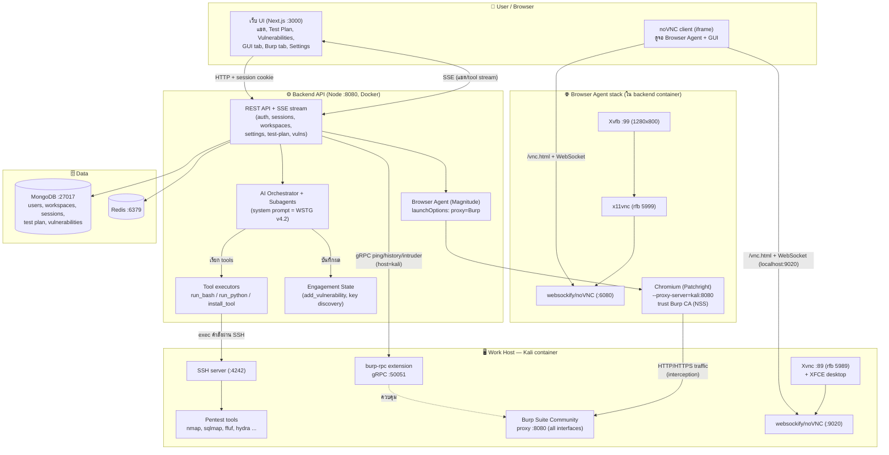

# VulnPen — System Swim Lane Diagram

แผนภาพแบบ Swim Lane ของระบบ โดยแต่ละ lane คือผู้เล่น/ส่วนประกอบหลัก
(render ด้วย Mermaid — วางใน GitHub / VS Code / mermaid.live ได้เลย)

## อ่านไหล่ยังไง (เส้นทางสำคัญ)

| เส้นทาง | อธิบาย |
|---|---|
| User → Backend → SSE → User | แชตกับ AI, tool call stream, ตาราง Test Plan / Vulnerabilities ทั้งหมดผ่าน REST + SSE ที่ :8080 |
| Backend → SSH → Kali | AI สั่ง `run_bash` → backend SSH เข้า kali (work host) รัน nmap/sqlmap ฯลฯ headless |
| Browser Agent lane | สั่ง agent → Magnitude launch Chromium บน Xvfb :99 → traffic วิ่งผ่าน Burp proxy (kali:8080) เพื่อ interception → ภาพจอส่งผ่าน x11vnc → noVNC :6080 → iframe ใน panel ขวา |
| GUI lane (ผู้ใช้ใช้เอง) | Xvnc :89 + XFCE บน kali → websockify :9020 → แท็บ GUI; Burp รันบน desktop นี้ด้วย |
| Burp RPC | backend เรียก gRPC :50051 เพื่ออ่าน Proxy History / ส่ง Intruder / ส่ง Repeater |
| Data | Mongo เก็บทุกอย่าง (session/plan/vuln), Redis เป็น queue/cache |
