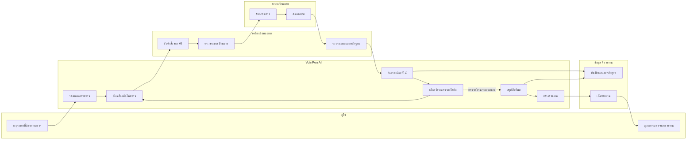

# VulnPen — Swim Lane Diagram

> แบ่งเป็นเลนตามผู้รับผิดชอบ เพื่อให้เห็นว่าแต่ละส่วนทำอะไร โดยไม่ใช้ emoji

## วิธีอ่าน

- **ผู้ใช้**: เริ่มการตรวจและรับผลลัพธ์
- **VulnPen AI**: วางแผน สั่งตรวจ วิเคราะห์ และสรุปผล
- **เครื่องมือทดสอบ**: ทำการตรวจจริงและรวบรวมหลักฐาน
- **ระบบเป้าหมาย**: ระบบที่ถูกตรวจและส่งผลกลับ
- **ข้อมูล / รายงาน**: เก็บผล หลักฐาน และรายงาน

### เส้นทางหลัก

**ผู้ใช้ → AI → เครื่องมือ → ระบบเป้าหมาย → เครื่องมือ → AI → ข้อมูล / รายงาน → ผู้ใช้**

ส่วน **AI → ตรวจต่อ** คือการวนกลับไปตรวจขั้นตอนถัดไปจนจบตามแผน
